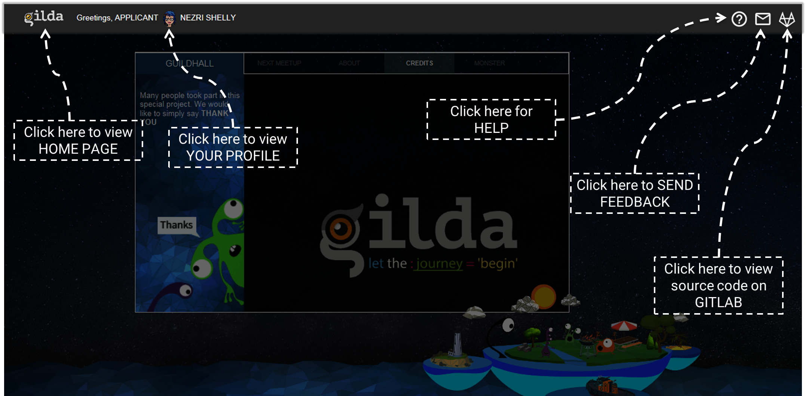
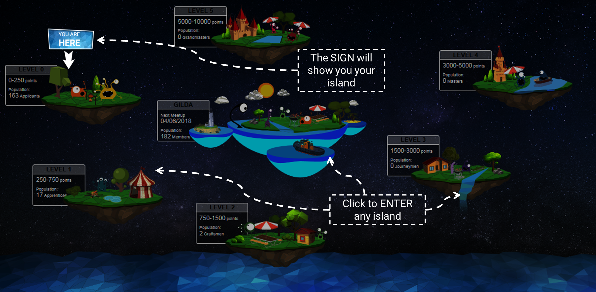
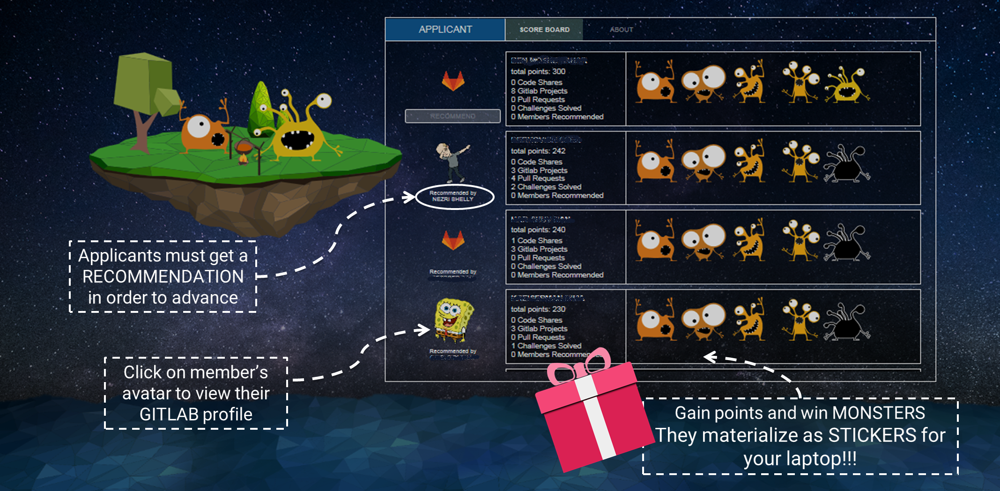
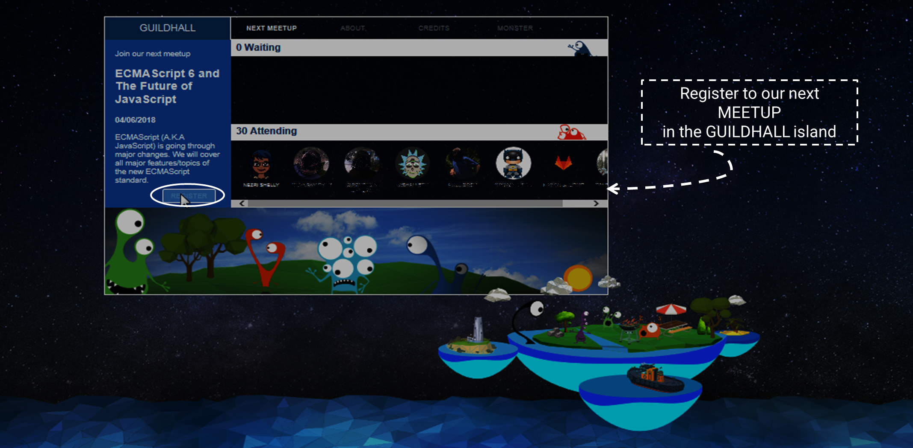
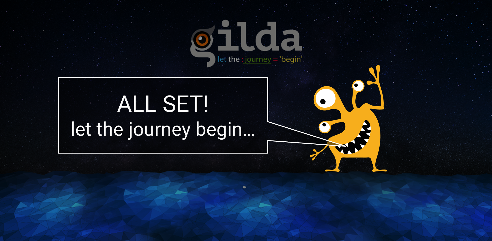

# Gilda explained
Gilda meaning Gild is named after the medieval organization of craftsmen that regulated the professional in the trade.
Gilda is a gamification of the effort to maintain organizational knowledge in Software centric organisations.

## Gilda tries to solve these problems
* Maintaining knowledge is very difficult there is no motivation because there is little appreciation of the effort
* Visibility across dev teams is limited 
* Who done it before or how is the expert on that subject is difficult to discover
* This is why Wikis and CMS style sites fail, information is collected for the grand opening but never updated or revisited
* This lack of maintaining of knowledge is costly. Rewriting the same controls on multiple web applications, rewriting Data Access layer time after time. Showing projects how to implement end to end logging, swagger and other tools to improve the quality of the applications across the organization and making debugging mush easier and faster.
Gilda is a two-part show, a gitlab site for the software projects (This is a knowledge sharing only Gitlab in which all projects are public) and the Gilda site in which users gain points and rank by contributing code and creating projects of shared code on the Gitlab site). The organization should think of how to show appreciation to contributors in the Stickers folder you can find pdf files that can be made into stickers that contributors can stick on there laptop to show their status.
Here are the images of the help section of the Gilda site.

##

##

##

##

|  Action         |   Points  |
| Gitlab User     |    30     |
| Gitlab avatar   |    50     |
| First Project   |    75     |
| Next 10 Projects|    20 each|
| Shared Project  |    50     |
|  .gitignore     |    5      |
|  Pull request   |    1      |
|  Contribution   |    100    |

##

##

